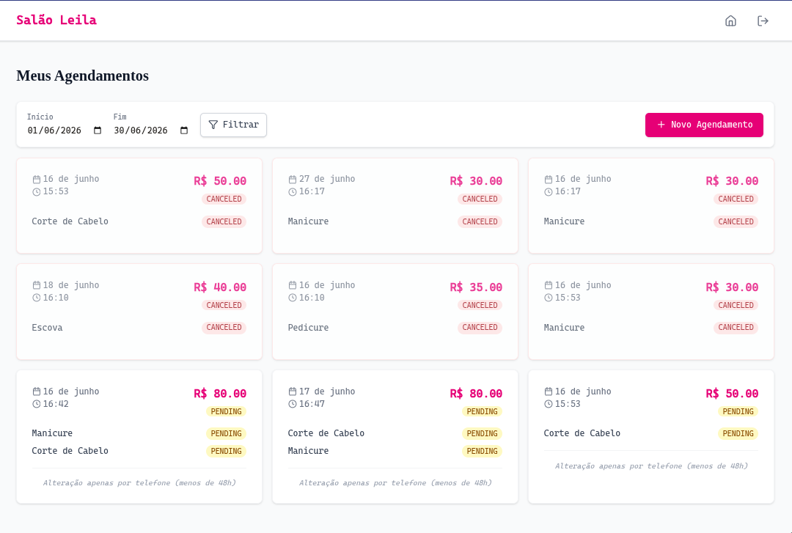
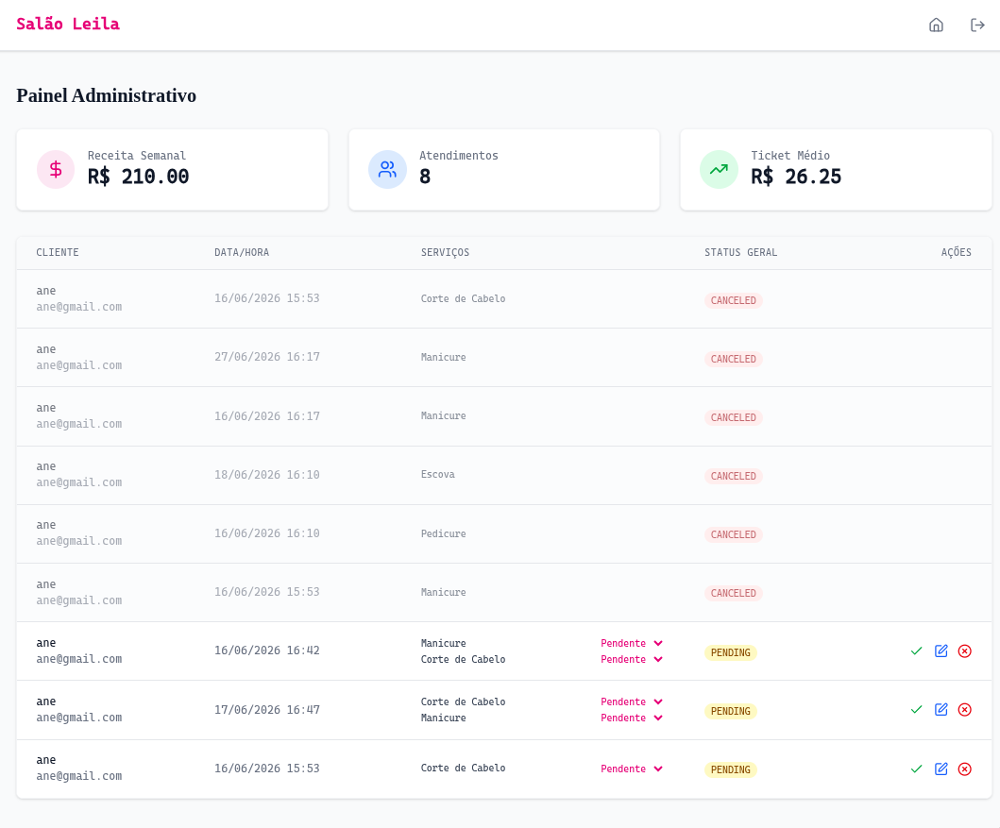
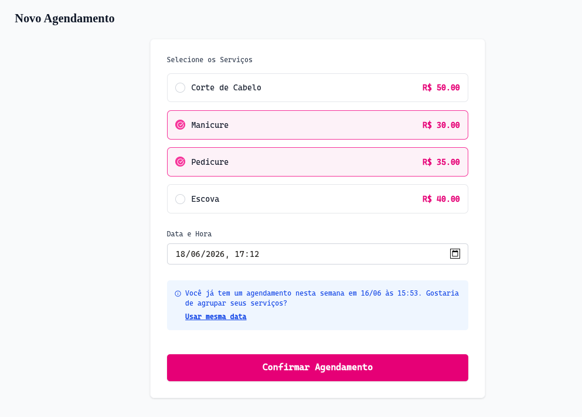

# Sistema de Agendamento - Salao da Leila

Esee projeto consiste em um sistema completo de gestao de agendamentos para o Salao da Leila, permitindo que clientes realizem agendamentos online e a administradora gerencie a agenda do salao de forma eficiente.


## Tecnologias Utilizadas

### Backend
- Java 17
- Spring Boot 4.1.0
- Spring Data JPA
- Spring Security com JWT
- Hibernate
- MySQL
- Maven
- Docker Compose

### Frontend
- React 19
- TypeScript
- Vite
- Tailwind CSS
- Lucide React (icones)
- Date-fns (manipulacao de datas)
- Axios

## Requisitos Funcionais

- RF00 - Autenticacao e Controle de Acesso: O sistema permite o cadastro de usuarios e realiza o login (autenticacao via token), diferenciando o nivel de acesso entre Clientes (acesso restrito aos proprios dados) e a Administradora (acesso total).
- RF01 - Agendamento de Servicos: O sistema permite que o cliente logado realize o agendamento de um ou mais servicos do catalogo.
- RF02 - Alteracao de Agendamento: O sistema permite que o cliente realize a alteracao de um agendamento existente (desde que pertenca a ele).
- RF03 - Bloqueio de Alteracao (Regra de Negocio): O sistema bloqueia a alteracao de um agendamento pelo cliente caso a data agendada seja menor que 2 dias (48 horas) de antecedencia, informando que a alteracao so podera ser feita por telefone.
- RF04 - Sugestao de Agrupamento: O sistema identifica se existe um agendamento do mesmo cliente para a mesma semana e sugere que os novos servicos sejam agendados na mesma data do primeiro agendamento.
- RF05 - Historico de Agendamentos: O sistema possui uma opcao de historico, permitindo ao cliente listar apenas os seus proprios agendamentos realizados em um determinado periodo.
- RF06 - Detalhes do Historico: O sistema possibilita a visualizacao detalhada dos servicos e status dos agendamentos listados no historico do cliente.
- RF07 - Alteracao Administrativa: O sistema permite que a administradora (Leila) tenha privilegios para alterar os agendamentos de qualquer cliente a qualquer momento, ignorando o bloqueio de 48 horas.
- RF08 - Listagem de Agendamentos: O sistema disponibiliza à administradora uma opcao para listar todos os agendamentos recebidos pelo salao de forma global.
- RF09 - Confirmacao de Agendamento: O sistema permite que a administradora realize a alteracao de status para confirmar o agendamento para o cliente.
- RF10 - Gerenciamento de Status: O sistema permite o gerenciamento do status (ex: Pendente, Concluido, Cancelado) de cada um dos servicos solicitados dentro de um agendamento de forma individual.
- RF11 - Acompanhamento de Desempenho: O sistema apresenta ferramentas gerenciais para a administradora que demonstrem o desempenho financeiro e de atendimentos semanal do salao.

## Documentacao de Arquitetura (ADR)

As decisoes arquiteturais do projeto estao documentadas na pasta `docs/adr`. Estes documentos explicam o "porquê" de certas escolhas tecnicas e de design.

## Como Rodar o Projeto

### Pre-requisitos
- JDK 17
- Node.js (v18 ou superior)
- Docker e Docker Compose

### Configuracao do Ambiente
1. No diretorio `backend/salon`, localize o arquivo `.env.example`.
2. Crie um arquivo `.env` na mesma pasta baseando-se no exemplo para configurar as variaveis de ambiente necessarias (como credenciais do banco de dados e segredo do JWT).

### Rodando com Docker (Recomendado)
Para subir o banco de dados MySQL e configurar as tabelas automaticamente, navegue ate `backend/salon` e execute:

```bash
docker-compose up -d
```
O Docker Compose ira criar o container do banco de dados e garantir que o esquema esteja pronto para uso pelo Spring Boot.

### Rodando o Backend manualmente
1. Navegue ate a pasta do backend:
   ```bash
   cd backend/salon
   ```
2. Execute o projeto usando o Maven Wrapper:
   ```bash
   ./mvnw spring-boot:run
   ```
O backend estara disponivel em `http://localhost:8080`.

### Rodando o Frontend manualmente
1. Navegue ate a pasta do frontend:
   ```bash
   cd frontend
   ```
2. Instale as dependencias:
   ```bash
   npm install
   ```
3. Inicie o servidor de desenvolvimento:
   ```bash
   npm run dev
   ```
O frontend estara disponivel em `http://localhost:5173`.

## Testes Unitarios

O projeto conta com uma suite de testes unitarios no backend para garantir a integridade das regras de negocio criticas. Os testes utilizam **JUnit 5** e **Mockito** para isolar o comportamento do servico.

### Principais Casos de Teste (AppointmentServiceTest)

- **Validacao da Regra de 48 Horas (RF03)**: Garante que um cliente nao consiga reagendar ou alterar um agendamento se faltarem menos de 48 horas para o inicio do servico. Isso e fundamental para proteger a previsibilidade da agenda do salao.
- **Privilegio Administrativo (RF07)**: Verifica se a administradora consegue ignorar a trava de 48 horas. Esse teste assegura que o sistema permite flexibilidade total para a Leila gerenciar casos de excecao.
- **Limite de Agendamento Semanal (RF04)**: Valida se o sistema bloqueia corretamente a criacao de mais de um agendamento por semana para o mesmo cliente, forcando o uso da funcionalidade de agrupamento de servicos e otimizando a logistica do salao.

### Por que estes testes?
1. **Integridade de Dados**: Garante que as regras de negocio complexas sejam aplicadas de forma consistente, independente de mudancas futuras no codigo.
2. **Seguranca**: Valida que as restricoes de acesso e operacao estao sendo respeitadas entre os diferentes niveis de usuario (Cliente vs Admin).
3. **Prevenção de Regressoes**: Permite que novas funcionalidades sejam adicionadas ou refatoracoes sejam feitas com a confianca de que o comportamento essencial do sistema nao foi quebrado.

## Dicas e Observacoes

- **Docker Compose**: O uso do Docker Compose no backend facilita a criacao das tabelas e a persistencia dos dados sem necessidade de instalacao manual do MySQL.
- **Variaveis de Ambiente**: Utilize o arquivo `.env.example` como guia obrigatorio para que a aplicacao suba corretamente com todas as configuracoes de seguranca.
- **Validacao de Datas**: O sistema utiliza o fuso horario local para validacoes. Certifique-se de que a data/hora do seu sistema esta correta ao testar a regra de 48 horas.
- **Tokens JWT**: A autenticacao e baseada em tokens. Se o token expirar, sera necessario realizar o login novamente.

## Midia do Projeto

### Prints do Sistema

- Dashboard do Cliente: 
- Painel Administrativo: 
- Formulario de Agendamento: 

### Video de Demonstracao

<video controls src="frontend/public/video.mp4" title="Title"></video>

[Assista ao vídeo de demonstração aqui](frontend/public/video.mp4)


---
Desenvolvido como parte do desafio tecnico para a DSIN.
